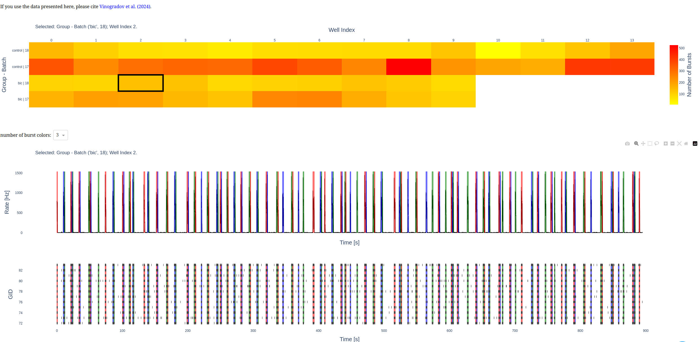
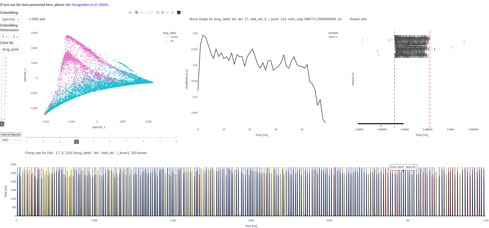

# Data-driven burst shape analysis for functional phenotyping of neuronal cultures

corresponding to [Schäfer et al., 2025, bioRxiv: Data-driven burst shape analysis for functional phenotyping of neuronal cultures](https://doi.org/10.1101/2025.09.29.679256)

```
@article{schaefer2025data-driven,
	author = {Sch{\"a}fer, Tim J. and Giannakakis, Emmanouil and Schmidt-Barbo, Paul and Levina, Anna and Vinogradov, Oleg},
	title = {Data-driven burst shape analysis for functional phenotyping of neuronal cultures},
	year = {2025},
	doi = {10.1101/2025.09.29.679256},
	journal = {bioRxiv},
}
```

# Tutorial
`notebooks/tutorial.ipynb` walks you through the basic pipeline step-by-step.

# Online tools
You can also try out the analysis pipeline without installing anything using the following online tools.

## Burst visualization
[Try burst visualization (10s loading time)!](https://review-inhibblock-659951261078.europe-west1.run.app)
This is used to visualize all recordings and for adjusting burst detection hyperparameters.



## Embedding visualization
[Try embedding visualization (10s loading time)!](https://embedding-inhibblock-659951261078.europe-west1.run.app)
This is used for visualizing the spectral embedding (of individual burst shapes) and exploring this burst shape space.



## Links for other datasets
<ul style="display: inline-block; text-align: left;">
    <li>Blocked inhibition --- Bicuculline (data: <a href="https://doi.org/10.1101/2024.08.21.608974" target="_blank">Vinogradov et al., 2024</a>)</li>
        <ul>
            <li><a href="https://review-inhibblock-659951261078.europe-west1.run.app" target="_blank">Burst visualization</a></li>
            <li><a href="https://embedding-inhibblock-659951261078.europe-west1.run.app" target="_blank">Embedding visualization</a> </li>
        </ul>
    <li>Kleefstra syndrom (hPSC) (data: <a href="https://doi.org/10.17632/bvt5swtc5h.1" target="_blank">Mossink et al., 2021</a>)
        <ul>
            <li><a href="https://review-mossink-659951261078.europe-west1.run.app" target="_blank">Burst visualization</a></li>
            <li><a href="https://embedding-mossink-659951261078.europe-west1.run.app" target="_blank">Embedding visualization</a> </li>
        </ul>
    </li>
    <li>CACNA1A mutation (data: <a href="https://doi.org/10.1101/2024.03.18.585506" target="_blank">Hommersom et al., 2024</a>)</li>
        <ul>
            <li>Burst visualization (data not public yet)</li>
            <li>Embedding visualization (data not public yet)</li>
        </ul>
    <li>Developing cultures (data: <a href="https://doi.org/10.1186/1471-2202-7-11" target="_blank">Wagenaar et al., 2006</a>)</li>
        <ul>
            <li>Burst visualization (dataset too large)</li>
            <li>Embedding visualization (dataset too large)</li>
        </ul>
</ul>


# Setup

## Installation
[Optional] Create a conda environment named `burst-shape` and `python=3.11` with
```bash
conda create -n burst-shape python=3.11
```
Activate the environment with
```bash
conda activate burst-shape
```

Install `src` module with
```bash
pip install -e .
```
which will run `setup.py`, making the `src` module available.

[Optional] If this fails to install the dependencies, you can install them manually with
```bash
pip install -r requirements.txt
```